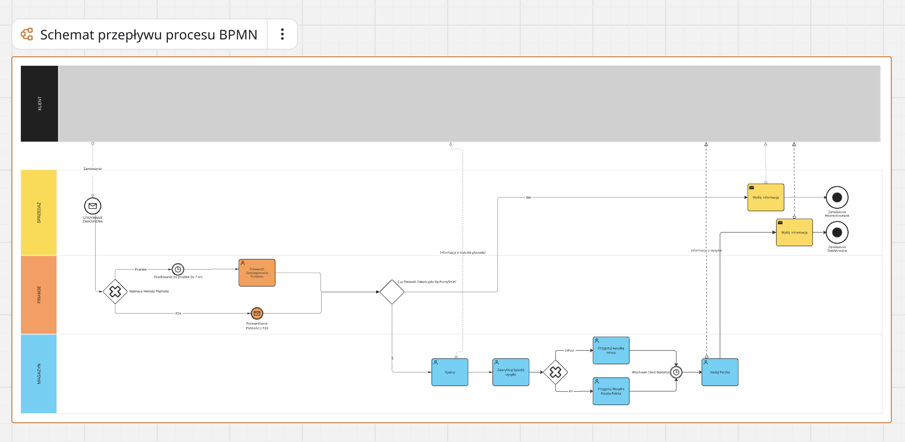
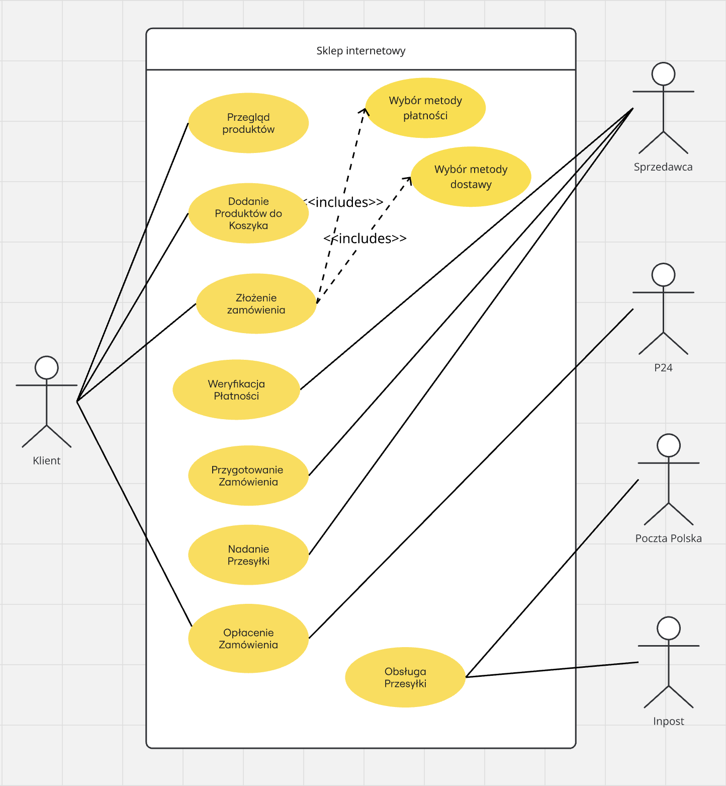
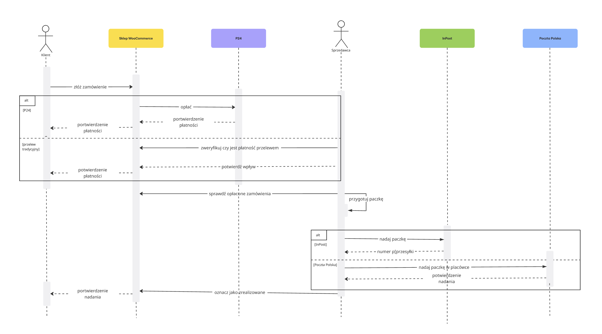

# AS-IS: Order Fulfillment Process

## Purpose

This document describes the current order fulfillment process of a Polish e-commerce store and identifies operational bottlenecks and improvement opportunities.

---

## Scope

### Included

* order placement
* payment processing
* payment verification
* order packaging
* shipment preparation
* shipment dispatch
* customer shipment notification

### Excluded

* returns
* complaints
* inventory management
* post-delivery customer support

---

## Process Diagram

---

## Process Participants

The process responsibilities are described using business roles.

In the analyzed organization, all operational activities are currently performed by the store owner.

| Participant                   | Responsibility                                                                          |
| ----------------------------- | --------------------------------------------------------------------------------------- |
| Customer                      | Places an order and selects payment and shipping method                                 |
| Store Owner                   | Processes orders, verifies payments, prepares shipments and communicates with customers |
| Payment Provider (Przelewy24) | Confirms online payments                                                                |
| Shipping Carrier              | Delivers physical products                                                              |

---

## Payment Flow

Customers can choose between two payment methods:

* Przelewy24
* Traditional bank transfer

### Przelewy24

Payment confirmation is received automatically from the external payment provider.

### Traditional Bank Transfer

Payment requires manual verification.

If payment is not received within 7 days, the order is cancelled.

---

## Shipping Flow

Available shipping methods:

* InPost Paczkomaty
* InPost Kurier
* Poczta Polska

Orders are packed after successful payment verification.

The current fulfillment process uses a shared operational workflow for all physical shipments.

In practice, shipment preparation and dispatch activities are often aligned with the operational requirements of Poczta Polska, including:

* visiting a physical post office,
* limited opening hours,
* manual shipment handling.

As a result, InPost shipments may wait for activities related to Poczta Polska shipments.

---

## Supporting Data

Shipment method distribution based on WooCommerce order data:

| Shipment Group                 | Orders |
| ------------------------------ | -----: |
| InPost                         |    304 |
| Poczta Polska                  |    242 |
| Digital products / no shipping |     78 |

For detailed metrics see:

`docs/metrics.md`

---

## Additional Modeling

The AS-IS process was additionally modeled using UML diagrams to provide complementary views of the same business process.

BPMN focuses on the business workflow and operational responsibilities, while UML diagrams help describe system interactions and communication between participants.

### UML Use Case Diagram

The UML Use Case Diagram visualizes the main actors involved in the e-commerce order fulfillment process and their interactions with the online store.

It helps identify who interacts with the system and what goals they are trying to achieve.

### UML Sequence Diagram

The UML Sequence Diagram shows how information is exchanged between participants during order fulfillment.

It focuses on communication between:

* Customer
* WooCommerce Store
* Przelewy24
* Store Owner
* InPost
* Poczta Polska

The diagram highlights two important process variants:

* payment through Przelewy24 or traditional bank transfer,
* shipment through InPost or Poczta Polska.

This view helps clarify dependencies between payment confirmation, shipment preparation, shipment dispatch and order completion.

---

## Key Observations

### Observation 1

The process supports multiple payment methods and shipment providers.

### Observation 2

The process is optimized around a single operational shipment workflow rather than around the capabilities of individual shipment providers.

### Observation 3

Traditional bank transfers require manual verification and may introduce processing delays.

### Observation 4

Operational requirements related to Poczta Polska can delay InPost shipments.

---

## Identified Pain Point

The current shipment process combines multiple shipment providers into a single operational workflow.

This creates unnecessary waiting time for InPost shipments and increases operational effort.

---

## Open Questions

* Can InPost shipments be dispatched independently from Poczta Polska shipments?
* What operational impact would a separate InPost dispatch flow introduce?
* What is the average time between payment confirmation and shipment dispatch?
* How should fulfillment performance be measured after process changes?
